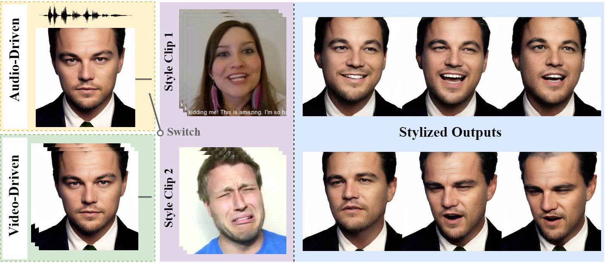

# Say Anything with Any Style

### Paper ID: 611



Given a source image and a style reference clip, SAAS generates stylized talking faces driven by audio. The lip motions are synchronized with the audio, while the speaking styles are controlled by the style clips. We also support video-driven style editing by inputting a source video. The pipeline of our SAAS is as follows:


## Requirements
We train and test based on Python 3.8 and Pytorch. To install the dependencies run:
```
conda create -n SAAS python=3.8
conda activate SAAS
```

- python packages
```
pip install -r requirements.txt
```

## Inference

- The size of pre-trained model has already exceeds the 50M limited in the [Submission Guidelines for Supplementary Material](https://aaai.org/aaai-conference/aaai-24-supplementary-material/). Moreover, in order not to compromise the anonymity, the download link of the model is not currently available.

- Run the demo in audio-driven setting:
    ```bash
    python audio_driven/train_test/inference.py --img_path path/to/image --wav_path path/to/audio --img_3DMM_path path/to/img_3DMM --style_path path/to/style --save_path path/to/save
    ```
  The result will be stored in save_path.

- Run the demo in video-driven setting:
    ```bash
    python video_driven/inference.py --img_path path/to/image --wav_path path/to/audio --video_3DMM_path path/to/video_3DMM --style_path path/to/style --save_path path/to/save
    ```
  The result will be stored in save_path.

## Evaluation
- We adopt the codes released by [vico_challenge_baseline](https://github.com/dc3ea9f/vico_challenge_baseline/tree/main/evaluations) to assess the results.

## Data Preprocess:
- Crop videos in training datasets:
    ```bash
    python data_preprocess/crop_video.py
    ```
- Split video: Since the video in HDTF is too long, we split both the video and the corresponding audio into 5s segments:
    ```bash
    python data_preprocess/split_HDTF_video.py
    ```

    ```bash
    python data_preprocess/split_HDTF_audio.py
    ```
- Extract 3DMM parameters from cropped videos using [Deep3DFaceReconstruction](https://github.com/microsoft/Deep3DFaceReconstruction):
    ```bash
    python data_preprocess/extract_3DMM.py
    ```
- Extract mel feature from audio:
    ```bash
    python data_preprocess/get_mel.py
    ```
- We save the audio mel features and 3DMM parameters in a lmdb file:
    ```bash
    python data_preprocess/prepare_lmdb.py
    ```
- Extract mfcc feature from audio for audio2pose module:
    ```bash
    python data_preprocess/get_mfcc.py
    ```
- Extract landmarks from cropped videos for facial discriminator:
    ```bash
    python data_preprocess/extract_lmdk.py
    ```
- Extract lankmarks of left/right eye, mouth by:
    ```bash
    python data_preprocess/parse_landmark.py
    ```
- We save the video frames and 3DMM parameters in a lmdb file:
    ```bash
    python data_preprocess/prepare_PIRender_lmdb.py
    ```
## Train
- Train Style Extraction module (style codebook):
    ```bash
    python style_extraction/train_test/train.py
    ```
- Train Audio-driven setting:
    ```bash
    python -m torch.distributed.launch --nproc_per_node=4 --master_port 12344 audio_driven/train_test/train.py
    ```
- Train Video-driven setting:
    ```bash
    python -m torch.distributed.launch --nproc_per_node=4 --master_port 12344 video_driven/train.py
    ```
- Train pose_encoder module (pose codebook):
    ```bash
    python audio2pose/train_test/train_vq.py
    ```
- Train audio2pose module:
    ```bash
    python audio2pose/train_test/train_vq_decoder.py
    ```
- Train FaceRender with facial discriminator module:
Please clone [PIRender](https://github.com/RenYurui/PIRender) first, and move the files in 'FaceRender_with_facial_discriminator' to the corresponding locations of cloned PIPender. Then, run:
    ```bash
    python -m torch.distributed.launch --nproc_per_node=4 --master_port 12344 train_dis.py
    ```
## Dataset
- We use the following dataset for training and testing.
1) **MEAD**. [download link](https://wywu.github.io/projects/MEAD/MEAD.html).
2) **HDTF**. [download link](https://github.com/MRzzm/HDTF).
- Part of test data presented in demo video .
1) **CREMA-D**. [download link](https://github.com/CheyneyComputerScience/CREMA-D).
1) **VoxCeleb2**. [download link](https://www.robots.ox.ac.uk/~vgg/data/voxceleb/vox2.html).

## Acknowledgement
Some code are borrowed from following projects:
* [Learning2Listen](https://github.com/evonneng/learning2listen)
* [PIRenderer](https://github.com/RenYurui/PIRender)
* [Deep3DFaceRecon_pytorch](https://github.com/sicxu/Deep3DFaceRecon_pytorch)
* [SadTalker](https://github.com/OpenTalker/SadTalker)
* [Style-ERD](https://github.com/tianxintao/Online-Motion-Style-Transfer)
* [GFPGAN](https://github.com/TencentARC/GFPGAN)
* [FOMM video preprocessing](https://github.com/AliaksandrSiarohin/video-preprocessing)

Thanks for their contributions!